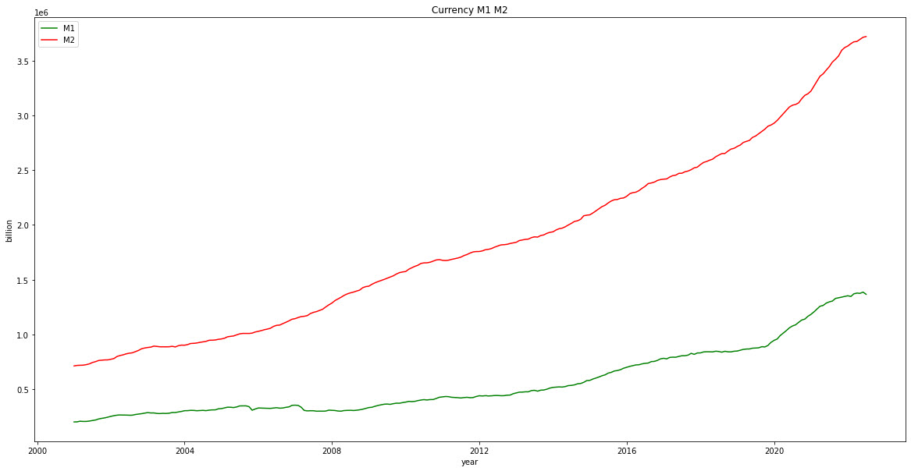

## M1 M1 비율 살펴보기  
 

1. 2008년 금융 위기전, 2005년 7월에 34.49% 로 최고점을 기록  
2. 2020년 7월부터 이전 최고점(34.49)이상을 넘어서며 최근에는 감소 추세로 돌아섬  

두 시점의 뉴스 기사를 살펴봄
1. 2008년 금융 위기전, 2005년 7월
  : 2005년 8월 31일, 연합뉴스 <8.31대책> 참여정부의 부동산시장 안정대책  

2. 2020년 7월, 2020년 7월 10일, KBS 7·10 대책 3줄 요약…다주택자 취득세+보유세+양도세 ‘동반’ 인상  

 

>결론        
2008년 이전 최고점인 34.49 인 값을 기준으로 살펴보니,두번 다 부동산 가격의 상승으로, 규제 대책이 발표 되었던 때였다.   
현재(2022.7)는 최고점 37.8 을 지나 36.8 정도이다. 아직 2008년 이전 최고점 34.49 보다 높은 수치이다.   
**M1/M2 비율은 부동산 가격 상승을 살펴보는 데 있어, 의미있는 수치**인것 같다.  

  

---

## 통화량 살펴보기 
 

1. M1 , M2 증가율 추이 (평잔, 원계열)  
 : 2020년에 들어서 M1, M2 가 급증  
 

2. M1, M2 전년동월 대비 증가율 추이  
 : 2018-19년 정도부터 M1 의 증가율이 매우 가파르다가, 최근들어 꺾이는 추세  
  
 
3. 경제주체별 M2 보유 추이   
 : 기업의 M2 보유가 증가하였으며, 가계는 상대적으로 감소하는 추세  
   
 
4. M1 / M2 비중  
 : M1 / M2 비율은 가계나 기업 등의 경제주체가 당장 집행할 수 있는 현금 보유 성향. 2019년 경부터 꾸준히 높아지다가, 최근 급등하였고, 현재는 감소하는 추세   
   
   

 ---

## 환율 살펴보기 
  
환율데이터로 원달러환율/이평90일/이평150일 의 시계열 차트를 그려보았다.  

2001년부터 데이터를 받았으나, 데이터가 많을 시, 그래프가 축소되게 보여, 2007년부터 그래프로 확인해보았다.  

 

 

*Point:*

이평 90 이나 이평 150 의 하락점이 시작될 때가 하락기에 진입하는 시점이 맞는지를 보려고 한다.  
대세 상승기에, 이평 90/150 에 하락변곡점이 있는가?   
만약 있다면 적절하지 않다고 판단하겠다. 

 

> 먼저 이평 90으로 확인해보겠다. 

1번의 경우  하락점시작시, 매도시에 적절 타이밍이라 볼 수 있겠다.

2번의 경우는 상승기에 , 한번 하락점이 있어 적절하지는 않다고 볼 수 있겠다.

3번의 경우도, 상승기에 하락점들이 보여 적절하지 않다고 볼 수 있겠다.

 

> 이평 150으로 확인해보겠다.

1번의 경우  하락점 시작시, 매도시에 적절 타이밍이라 볼 수 있겠다.

2번의 경우는 하락점 시작시, 매도시에 적절 타이밍이라 볼 수 있겠다.

3번의 경우도,  하락점 시작시, 매도시에 적절 타이밍이라 볼 수 있겠다.

=> 하락점 시작 시에, 하락기에 진입한 것이라고 볼 수 있다.

 

>결론 :  
이평 150 으로 하락 변곡점 시작시 매도 시, 최대로 환차익을 볼수는 없지만, 추세적으로는 적절한다고 판단

